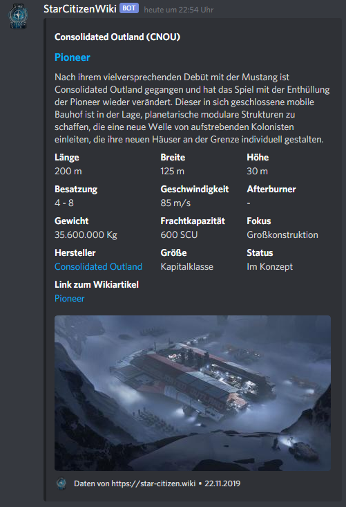
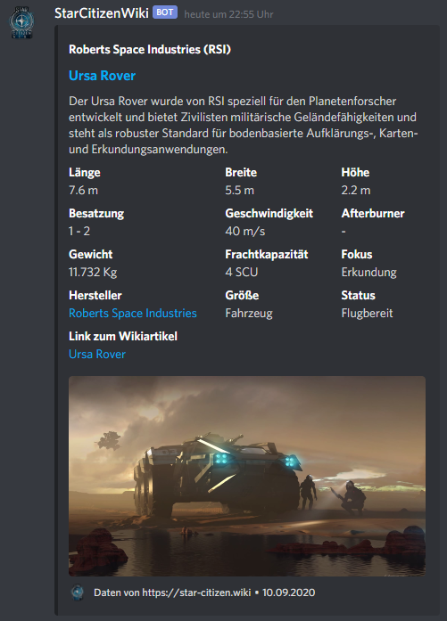
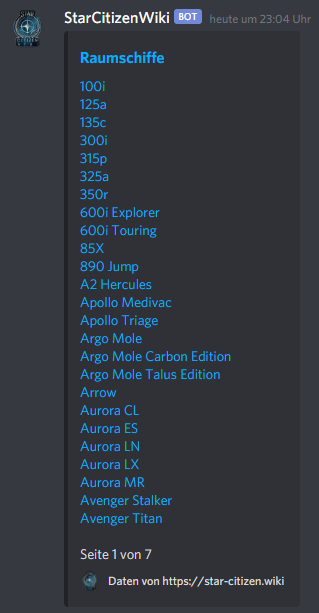
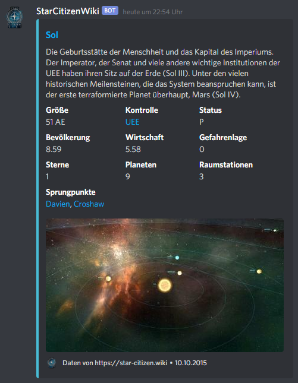
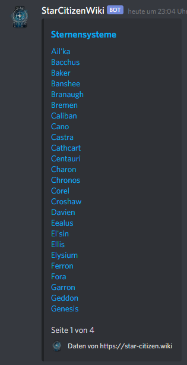
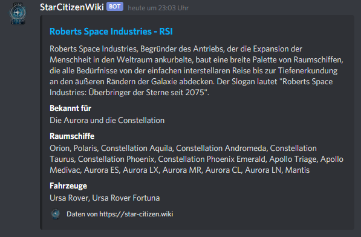
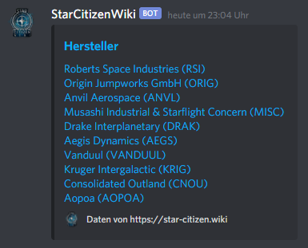
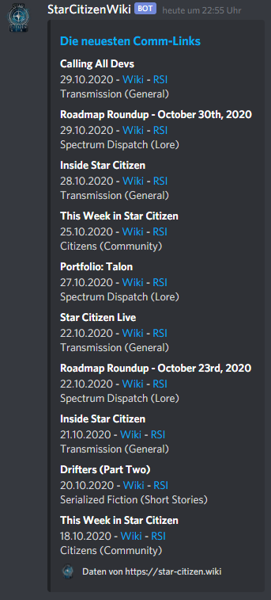

# discord-bot
<p align="center">
    <a href="https://discord.com/api/oauth2/authorize?client_id=770734131213500466&permissions=52224&scope=bot" alt="Add Bot">
        
    </a>
    <a href="https://hub.docker.com/r/scwiki/discord-bot" alt="Docker Hub">
        
    </a>
</p>

A Star Citizen Discord Bot using data from [the Star Citizen Wiki API](https://api.star-citizen.wiki).

[German Citizen Spotlight text](docs/german_spotlight_text.md)

## Features
### Ship and Vehicle Cards
Command `sc_ship Pioneer`



Command `sc_vehicle Ursa Rover`



#### Listing all available ships and vehicles
Calling the command without arguments outputs a list of all available ships or vehicles.  

Command `sc_ship`



### Starsystem Cards
Command `sc_system Sol`



#### Listing all available systems
Calling the command without arguments outputs a list of all available starsystems.  

Command `sc_system`



### Manufacturer Cards
Command `sc_manufacturer RSI`



#### Listing all available manufactuer
Calling the command without arguments outputs a list of all available manufacturer.  

Command `sc_manufacturer`



### Comm-Link Cards
Command `sc_comm-links`



#### Channel Notifications
Additionally you can a channel to receive notifications if new comm-links were published.  
`sc_comm-links add` -> Adds the current channel to receive notifications.  
`sc_comm-links remove` -> Removes the current channel from receiving notifications.  

## Commands
* `sc_ship name`
  * Get information about a ship or vehicle by name
* `sc_manufacturer name`
  * Get information about a manufacturer by name
* `sc_system name`
  * Get information about a system by name
* `sc_stats`
  * Get information about the current funding and fleet stats
* `sc_status`
  * Get information about the current server status
* `sc_nation`
  * Get information about all available nations in the wiki
* `sc_person`
  * Get information about all available persons in the wiki
* `sc_help`
  * List available commands

Note: Only "official" data (shipmatrix for vehicles / ships and starmap for systems), will be returned. 
  
## config.json
```json
{
  "prefix": "sc_",
  "token": "Bot Token",
  "api_token": null,
  "api_url": "https://api.star-citizen.wiki",
  "wiki_url": "https://star-citizen.wiki",
  "locale": "de_DE",
  "footer": {
    "text": "Daten von https://star-citizen.wiki",
    "icon_url": "https://cdn.star-citizen.wiki/favicon.png"
  }
}
```

## Build
`docker build -t scw/discord-bot .`

## Run
`docker run --name discord-bot -d -v /opt/discord-bot/config.json:/home/node/app/config.json scw/discord-bot `

`docker run --name discord-bot --restart unless-stopped -d -v /opt/discord-bot/config.json:/home/node/app/config.json  -v /opt/discord-bot/db.json:/home/node/app/db.json scw/discord-bot`
