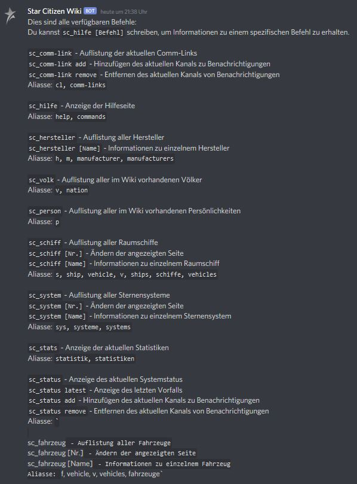
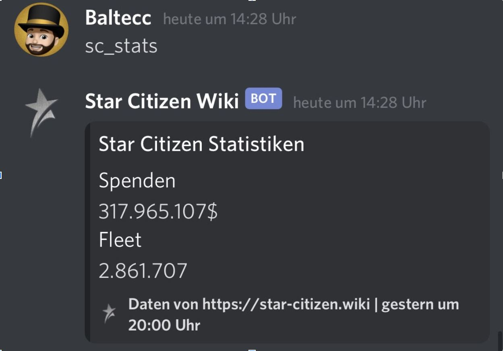
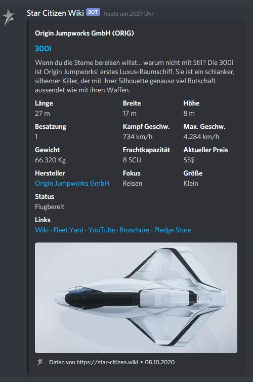
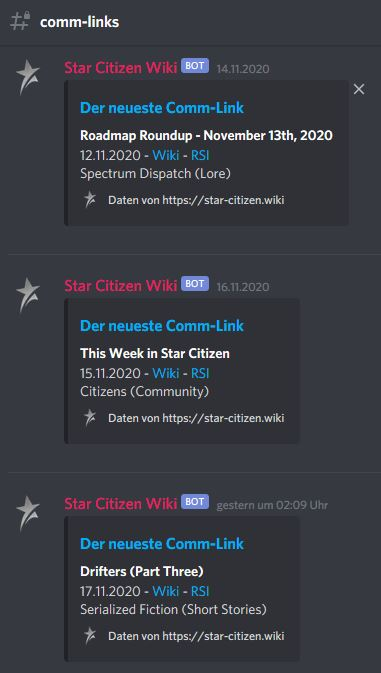
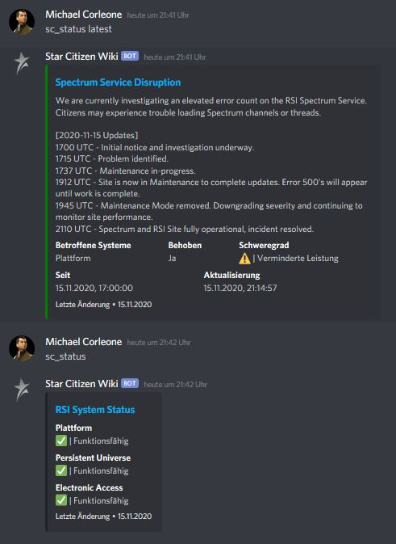

Seid gegrüßt Sternenbürger,

wir vom deutschsprachigen Star Citizen Wiki möchten euch mit voller Stolz unseren Discord Bot vorstellen!

Ein Bot der zur Informationserstattung rund um Star Citizen in Zukunft keinen eurer Wünsche mehr offen lassen soll. Für seine stetige Weiterentwicklung benötigen wir euch, die Star Citizen Community, mit all euren Wünschen, Ideen und Verbesserungsvorschlägen.

Doch erstmal von Anfang an. Was kann der Star Citizen Wiki Discord Bot eigentlich schon?

Abrufen von Schiffs- und Fahrzeugdaten in kompakter, ansprechender Form, 
Auflistung aller bisher veröffentlichten Schiffe und Fahrzeuge,
Abruf von Sternsystemdaten und eine Liste aller bislang bekannten Sternensysteme, (Sternsystemdaten aus der Starmap von RSI und größtenteils deren Galactic Guide Artikel)
Abruf einer Übersicht aller Manufakturen aus Star Citizen und jeweils eine Karte mit vielen weiteren Details zu diesen Herstellern,
Abruf aller Comm-Link Artikel von RSI,
Abruf aller Völker und einiger Personen aus dem Star Citizen Universum.

Natürlich können Serverstatus oder Mitteilungen von neu veröffentlichten Artikeln aus dem RSI Comm-Link mit eurem Discord Server verknüpft werden, damit Ihr keine Nachrichten verpasst.

Was unterscheidet den Star Citizen Wiki Bot von dem englischen Pendant? Ganz klar, wir liefern in deutscher Sprache! Überzeugt euch selbst.

Für die Installation des Bots auf eurem Discord Server, müsst ihr nichts weiter tun, als diesen über den folgenden Link einzubinden:

[Star Citizen Wiki Discord Bot hier einbinden](https://discord.com/api/oauth2/authorize?client_id=770734131213500466&permissions=52224&scope=bot)

Nach seiner erfolgreichen Implementierung solltet ihr als erstes folgenden Befehl ausführen:

sc_hilfe bzw. sc_help bzw. sc_commands.

Ihr bekommt nun alle weiteren aktuell möglichen Befehle, um den Wiki Bot zu nutzen:

Primär habt ihr mit dem Bot also ein wandelndes Lexikon, welches euch Informationen zu Schiffen, Fahrzeugen, Herstellern, Völkern, Sternensystemen und Charakteren aus dem Star Citizen Universum gibt. Darüber hinaus könnt Ihr euch auch die aktuellen Statistiken zu Star Citizen ausgeben lassen:

Bei dem Aufruf von Informationen zu einem Schiff zum Beispiel, erhaltet ihr folgende Antwort:

Unterhalb der abgerufenen Daten habt ihr folgende Links zur Wahl:

Wiki Artikel
Fleet Yard Seite, um das Schiff eurer Flottenübersicht hinzuzufügen
Passendes YouTube Video (Trailer, Dev Video, etc.)
Schiffsbroschüre (sofern vorhanden)
Pledge Store Seite auf RSI

Bedenkt bitte, dass aktuell nicht immer alle Links bei jedem Schiff ersichtlich sind. Entweder es gibt dazu keine Infos oder die Infos wurden auf dem Star Citizen Wiki noch nicht aktualisiert.

Das ist aber immer noch nicht alles! Neben den ganzen „Lexikon“ Funktionen, kann der Discord Bot noch mehr!

Er kann euch nach entsprechender Einrichtung (im gewünschten Text Channel) automatisch folgende Infos liefern:

Die neuesten Comm-Links (Wie bereits erwähnt, erhalten wir die Texte dank professioneller Übersetzungs-KI, in deutscher Sprache. Wir verwenden mit steigender Zufriedenheit seit 2018 die API von dem Kölner Anbieter https://www.deepl.com. Dennoch sind wir auf jede helfende Hand aus der Community angewiesen und dankbar!)

Serverstatus von RSI (teilweise in deutscher Sprache)

Ihr seht, der Star Citizen Wiki Discord Bot ist nicht nur ein Lexikon, sondern vielmehr ein hilfreiches Rundum-Sorglos-Paket, wenn es um die Informationsdarstellung von Star Citizen Inhalten auf eurem Discord Server geht.

Da wir den Bot stetig erweitern wollen, freuen wir uns sehr über euer Feedback.

Lasst uns einfach unter info@star-citizen.wiki eine Nachricht da.

Solltet ihr euch für die abgerufenen Daten interessieren, hier gehts zur Star Citizen Wiki API.

Und nun wünschen wir euch viel Spaß mit dem Discord Bot!

Der Star Citizen Wiki Discord Bot entstand in Kooperation zwischen der Rivven Community und dem deutschsprachigen Star Citizen Wiki.

Der Dank für die technische Entwicklung und Umsetzung geht wie immer an unseren Code Guru @FoXFTW.

Ihr könnt Fox direkt unterstützen, wenn ihr bei der erstmaligen Registrierung auf RSI, seinen Referral Code verwendet (STAR-CRPN-GJNT) aber pssst, nicht weitersagen ;)

Und eine große Freude bereitet ihr uns, wenn ihr auf dem Community Hub, den Artikel dazu upvoted. Den Artikel findet ihr hier:

https://robertsspaceindustries.com/community/citizen-spotlight/19334-GERMAN-Star-Citizen-Wiki-Discord-Bot

                     
